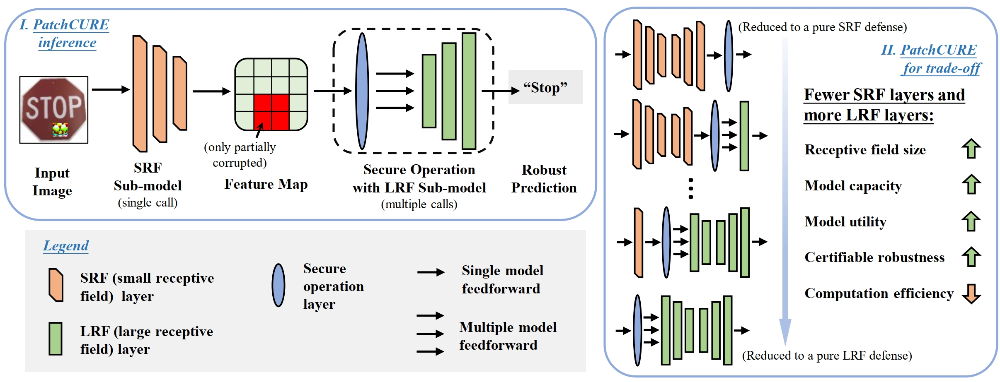

# Enhancing PATCHCURE: Improving Robustness, Utility, and Efficiency in Adversarial Patch Defenses

Code for [Enhancing PATCHCURE:
Improving Robustness, Utility, and Efficiency in Adversarial Patch Defenses]. 

# Enhanced PATCHCURE

This project extends the [PATCHCURE](https://arxiv.org/abs/2310.13076) framework to improve robustness, clean accuracy, and inference speed under adversarial patch attacks. It includes three practical enhancements designed for real-world deployment and evaluation on CIFAR-10 and ImageNet.

---

## 🔍 Background

Adversarial patch attacks are a class of physical-world adversarial examples that fool deep vision models using localized, visible image perturbations. These attacks pose serious threats in high-stakes settings like autonomous driving, facial recognition, and surveillance.

**PATCHCURE** addresses the key challenge of balancing the **three-way trade-off** between:
- **Certifiable Robustness**: Provable guarantees that predictions remain stable under patch attacks.
- **Model Utility**: Maintaining high clean accuracy on benign inputs.
- **Computational Efficiency**: Achieving fast, scalable inference.

  
### Framework



It does so by combining **Small Receptive Field (SRF)** and **Large Receptive Field (LRF)** sub-models and using a masking-based secure operation. By adjusting a "split layer" \(k\), PATCHCURE allows users to choose their trade-off point.

---

## 🚀 Enhancements in This Version

We introduce three practical upgrades to the original PATCHCURE framework:

- **Hyperparameter Optimization**  
  Tuned patch size and mask stride to slightly boost clean and certified accuracy without changing the architecture.

- **Test-Time Augmentation (TTA)**  
  Applied lightweight augmentations (e.g., flips, rotations, contrast shifts) during inference to improve clean accuracy in real-world conditions.

- **Redesigned Secure Operation**  
  Replaced argmax-based aggregation with a softmax-based, confidence-aware voting scheme. Also optimized secure masking with batch operations to dramatically improve throughput.


## Dependency

Tested with `torch==1.13.1` and `timm==0.9.16`. This repository should be compatible with newer version of packages. `requirements.txt` lists other required packages (with version numbers commented out).

## Files

```shell
├── README.md                        # this file 
├── requirements.txt                 # required packages
├── example_cmds.sh                  # command to reproduce PatchCURE results reported in the paper
├── reproducibility.md               # detailed guide for experiments. used for artifact evaluation at USENIX Security 
├── get_imagenet_val.sh              # script for downloading ImageNet val dataset.  
| 
├── main.py                          # PatchCURE entry point.  
| 
├── utils
|   ├── builder.py                   # utils for building models and getting data loaders
|   ├── pcure.py                     # utils for PatchCURE inference algorithms 
|   ├── split.py                     # utils for splitting models into sub-models for PatchCURE construction
|   ├── bagnet.py                    # BagNet model; adapted from https://github.com/wielandbrendel/bag-of-local-features-models/blob/master/bagnets/pytorchnet.py
|   └── vit_srf.py                   # ViT-SRF model; based on timm/models/vision_transformer.py 
|
| 
├── data   
|   └── imagenet                     # data directory for imagenet # use torchvision.datasets.ImageFolder
|
└── checkpoint                      # directory for checkpoint
    ├── README.md                    # details of checkpoint
    └── ...                          # model checkpoint
```

## Dataset

- [ImageNet](https://image-net.org/download.php) (ILSVRC2012).
- [CIFAR-10](https://www.cs.toronto.edu/~kriz/cifar.html) - will be downloaded automatically within our code (not the main focus of our experiments and only used in Table 4)

## Getting Started

1. See **Files** for details of each file. 
2. Download data in **Datasets** to `data/`.
3. Read [`checkpoint/README.md`](checkpoint/README.md) and download checkpoint from Google Drive [link](https://drive.google.com/drive/folders/146Qy-FKgSKrzuaaSluafhm3jYDQzYERj?usp=sharing) and move them to `checkpoint`.
4. See [`example_cmd.sh`](example_cmds.sh) for example commands for running the code and reproducing Enhanced PatchCURE results reported in the paper.
5. See [`reproducibility.md`](reproducibility.md) for a more detailed guide for running experiments. 

